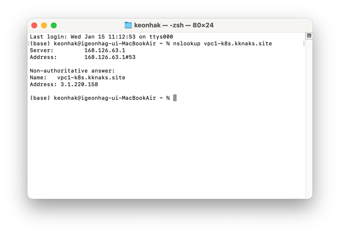

## kubernetes
### kubernetes의 기본개념
- kubernates는 컨테이너화된 애플리케이션을 자동으로 배포, 스케일링 및 관리하는 오픈소스 플랫폼이다.
- kubernetes는 컨테이너 오케스트레이션 툴로, 컨테이너화된 애플리케이션을 배포, 확장, 관리하는 작업을 자동화한다.

### kubernetes의 기본용어
#### 클러스터
- 클러스터는 여러개의 서버를 하나의 그룹으로 묶어서 관리하는 것을 의미한다.
- kubernetes 클러스터는 마스터노드와 워커노드로 구성된다.

#### 


#### Pods (파드)
1) 개념
파드는 쿠버네티스의 가장 기본적인 배포 단위입니다. 하나 이상의 컨테이너를 포함하는 그룹으로, 같은 파드 내의 컨테이너들은:
- 동일한 네트워크 네임스페이스를 공유
- 동일한 IP 주소와 포트 공간을 공유
- 동일한 IPC 네임스페이스를 공유
- 동일한 호스트 이름을 공유

2) 특징
- 각 파드는 고유한 IP 주소를 가짐
- 파드 내의 컨테이너들은 localhost를 통해 서로 통신 가능
- 파드는 일시적(ephemeral)인 특성을 가짐 
- 언제든 종료되고 새로 생성될 수 있음




## 

### 파드의 특징
- 각 파드는 고유한 IP 주소를 가짐
- 파드 내의 컨테이너들은 localhost를 통해 서로 통신 가능
- 파드는 일시적(ephemeral)인 특성을 가짐 - 언제든 종료되고 새로 생성될 수 있음

## ReplicaSets (레플리카셋)

레플리카셋은 지정된 수의 파드 복제본이 항상 실행되도록 보장하는 리소스입니다.

### 레플리카셋의 주요 기능
- 지정된 수의 파드가 항상 실행되도록 유지
- 파드 장애 발생 시 자동으로 새로운 파드 생성
- 노드 장애 시 다른 노드에 파드를 재생성
- 수평적 확장/축소 지원

### 레플리카셋의 구성 요소
```yaml
apiVersion: apps/v1
kind: ReplicaSet
metadata:
  name: example-replicaset
spec:
  replicas: 3                    # 원하는 파드 복제본 수
  selector:                      # 관리할 파드를 선택하는 라벨 셀렉터
    matchLabels:
      app: example
  template:                      # 파드 템플릿
    metadata:
      labels:
        app: example
    spec:
      containers:
      - name: nginx
        image: nginx:1.14.2
```

## Deployments (디플로이먼트)

디플로이먼트는 레플리카셋을 관리하며, 애플리케이션의 선언적 업데이트를 제공하는 상위 수준의 리소스입니다.

### 디플로이먼트의 주요 기능
1. **롤링 업데이트**: 무중단 업데이트 지원
2. **롤백**: 이전 버전으로 쉽게 되돌리기 가능
3. **배포 이력**: 이전 배포 상태 기록 유지
4. **스케일링**: 애플리케이션 규모 조정
5. **일시 중지와 재개**: 업데이트 일시 중지 및 재개 가능

### 디플로이먼트의 구성 예시
```yaml
apiVersion: apps/v1
kind: Deployment
metadata:
  name: example-deployment
spec:
  replicas: 3
  strategy:
    type: RollingUpdate        # 업데이트 전략
    rollingUpdate:
      maxSurge: 1             # 최대 초과 허용 파드 수
      maxUnavailable: 1       # 최대 불가용 허용 파드 수
  selector:
    matchLabels:
      app: example
  template:
    metadata:
      labels:
        app: example
    spec:
      containers:
      - name: nginx
        image: nginx:1.14.2
```

## 세 리소스의 관계

1. **계층 구조**
  - Deployment → ReplicaSet → Pod
  - 각 상위 리소스는 하위 리소스의 라이프사이클을 관리

2. **일반적인 사용 패턴**
  - 직접 Pod 생성 < ReplicaSet 사용 < Deployment 사용
  - 대부분의 경우 Deployment를 통해 관리

3. **업데이트 프로세스**
   ```
   Deployment 업데이트
         ↓
   새로운 ReplicaSet 생성
         ↓
   새로운 Pod 생성
         ↓
   이전 Pod 제거
         ↓
   이전 ReplicaSet 보존 (롤백 가능)
   ```

## 모범 사례

1. **항상 Deployment 사용**
  - 직접 ReplicaSet이나 Pod를 관리하는 것은 피함
  - Deployment가 제공하는 기능을 활용

2. **적절한 레이블 사용**
  - 의미 있는 레이블을 사용하여 리소스 관리
  - 환경, 앱 버전, 티어 등을 레이블로 구분

3. **리소스 요청과 제한 설정**
  - 컨테이너의 리소스 요청과 제한을 명시적으로 설정
  - 클러스터 리소스 효율적 사용

4. **헬스 체크 구현**
  - liveness, readiness 프로브 설정
  - 안정적인 애플리케이션 운영 보장


워커 노드와 마스터 노드에 다음과 같이 분배됩니다:

### 마스터 노드에 있는 구성요소
- **kube-apiserver**: API 서버로 쿠버네티스 API를 제공
- **etcd**: 모든 클러스터 데이터를 저장하는 키-값 저장소
- **kube-scheduler**: 새로운 파드를 어떤 노드에 배치할지 결정
- **kube-controller-manager**:
  - Deployment Controller
  - ReplicaSet Controller
  - 기타 다양한 컨트롤러들

### 워커 노드에 있는 구성요소
- **실제 파드들**(애플리케이션 컨테이너)
- **kubelet**: 각 노드에서 파드와 컨테이너들이 정상적으로 동작하는지 관리
- **kube-proxy**: 네트워크 규칙과 포워딩을 관리

예를 들어:
1. Deployment를 생성하면 그 정보는 마스터 노드의 etcd에 저장됩니다
2. 마스터 노드의 컨트롤러들이 ReplicaSet과 Pod를 생성합니다
3. 실제 Pod는 워커 노드에서 실행됩니다

따라서, 설계도(Deployment, ReplicaSet 정의)는 마스터 노드에서 관리되고, 실제 애플리케이션(Pod)은 워커 노드에서 실행된다고 보시면 됩니다.

### kubernetes 클러스터 생성
1) nslookup vpc1-k8s.sik2.site 로 확인
2) aws 클러스터 생성
- on master
- on worker
3) 칼리코 설정
> 칼리코
- kubectl 설치
4) 클러스터 구성 취소 방법
- on master
- on worker

### kubectl 자동완성기능 활성화 

### nginx 최신버전 이미지로, 이름이 webserver 인 pod를 띄우기
- nginx 이미지를 조장이 띄울때 한가한 조원 서버에 알아서 띄우게 된다.
- 외부접근 불가능
- 명령어 

### 디플로이먼트, 리플리카셋, 파드

### 서비스명으로 포워딩 할수있게 하는 준비작업
1) nginx 는 마스터 노드에 설치
2) nginx-proxy-manager-1.yaml 적용
3) worker 노드에 nginx 설치


외부 요청 → nginx-proxy-manager → Pod의 애플리케이션(예: Node.js, Python 등)

Copy예시:
워커노드1
- Pod1 (app: php-test-1, IP: 10.10.130.130)

워커노드2
- Pod2 (app: php-test-1, IP: 10.10.208.67)

Service (php-test-1)
- selector: app: php-test-1
- port: 8000
