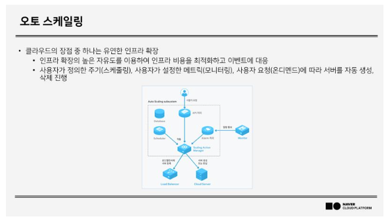
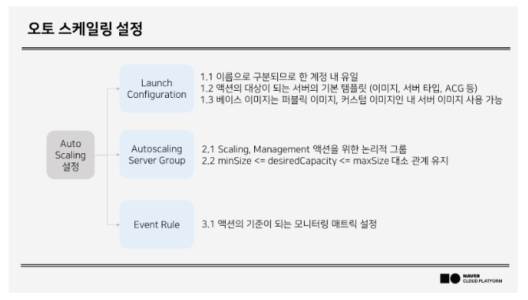
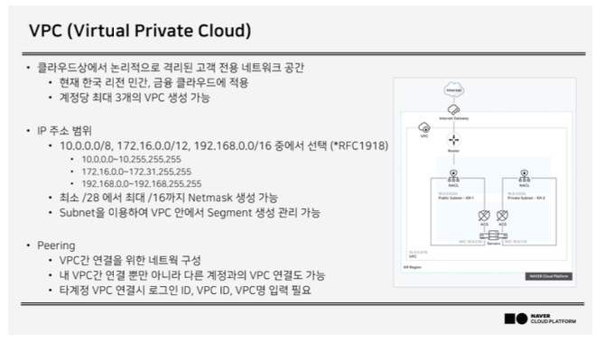
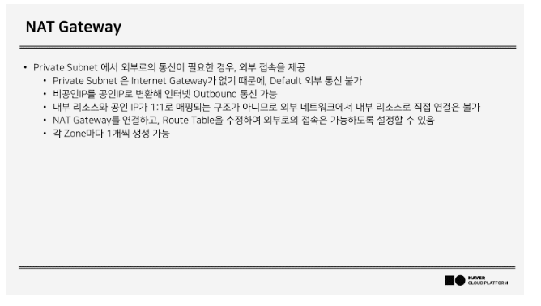
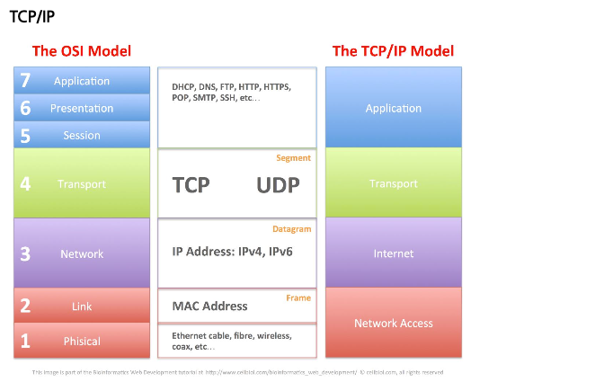
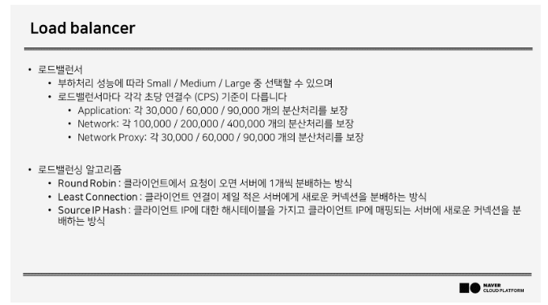

# server
## image 생성
## snapShot
## IOPS

# 오토스케일링

# 네트워크

- 계정당 3개 
- 각각의 Vpc 간에 통신은 피어링을 이용해야한다. 

## NAT GateWay

- 사설 IP주소를 공인 IP변환 해서 외부 네트워크와 통신 

## TCP/IP

## 로드밸런서

## DNS 서비스

- @naver.com
- www A 223.130.200.219
- 219 PTR www.naver.com
- www2 CNAME www. 만 캐싱 나머지는 A레코드 타입으로 검색
- NS(위임)
  - blog A 223.10.10.10
  - a.blog A 223.10.10.11
  - b.blog A 223.10.10.12 
  - => blog NS 223.10.10.100 @blog.naver.com
  - a A 233.10.10.11
  - b A 233.10.10.12

## global traffic manager
- GSLB : 레이턴시가 좋은 아이피를 리턴 
  - CIDR, Round robin, Weighted Based
- GTM : 각 지역별 DNS를 설정하여 근접지역의 IP의 서버를 리턴
  - GeoLocation

## CDN

## SSL VPN

## VM & Container

## file system
