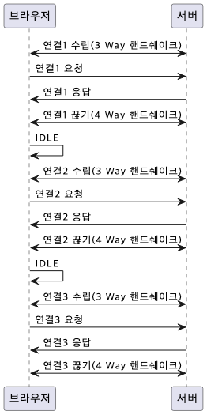
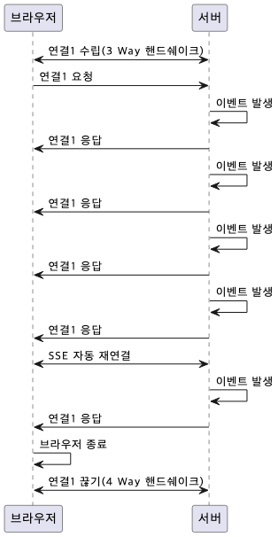
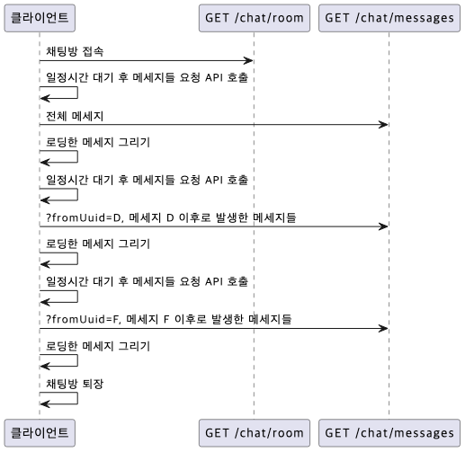
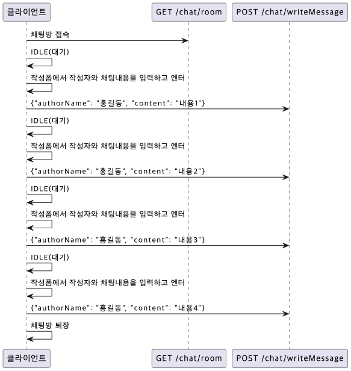

# Day01_OT, 채팅기능구현

## OT
- 강의 소개
- 교육과정 소개
- 

## 채팅서비스 구현하기
### HTTP를 활용한 통신방식
- HTTP는 클라이언트의 요청이 있을 때만 응답을 하기 때문에 실시간 통신을 구현하기 어렵다.
- 폴링방식, 롤폴링방식을 활용한 유사한 방법을 사용하거나, SSE통신 방식을 사용하여 실시간 통신을 구현 할 수 있다.

### 폴링 방식
- 클라이언트가 서버에게 주기적으로 요청을 보내는 방식
- 서버는 클라이언트의 요청에 응답을 보내는 방식
- 클라이언트가 서버에게 요청을 보내는 시간 간격을 조절하여 실시간 통신을 구현할 수 있음
- 클라이언트가 서버에게 요청을 보내는 시간 간격을 짧게 하면 서버에게 부하가 걸리게 됨
  

### SSE(Server-Sent Events) 통신 방식
- 서버에서 클라이언트로 데이터를 보내는 단방향 통신 방식
- 클라이언트가 서버에게 요청을 보내는 방식이 아닌 서버에서 클라이언트로 데이터를 보내는 방식
- 서버에서 클라이언트로 데이터를 보내는 방식이기 때문에 클라이언트가 서버에게 요청을 보내는 시간 간격을 조절할 수 없음
  

### 폴링방식을 활용한 채팅기능 구현
#### 메시지를 불러오는 구조
- /chat/messages 전체 채팅 메세지 조회
- ?fromUuid=D, 메세지 D 이후로 발생한 메세지들
- ?fromUuid=F, 메세지 F 이후로 발생한 메세지들
  

#### 메시지를 작성하는 구조
- 엔터칠때마다 서버에 메세지를 전송하는 방식
  

